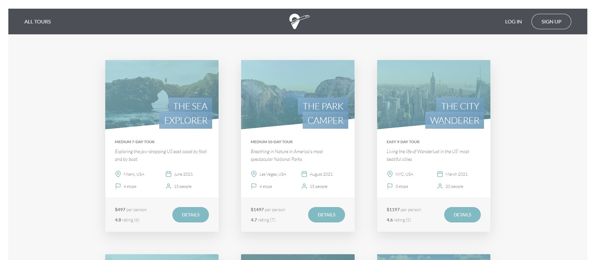

# TourNest - Travel Website



## Table of Contents

- [Project Description](#project-description)
- [Features](#features)
- [Technologies Used](#technologies-used)
- [Project Structure](#project-structure)
- [API Routes](#api-routes)
  - [Booking Routes](#booking-routes)
  - [Review Routes](#review-routes)
  - [Tour Routes](#tour-routes)
  - [User Routes](#user-routes)
  - [View Routes](#view-routes)
- [Security Features](#security-features)
- [Installation](#installation)
- [Usage](#usage)
- [Contributing](#contributing)

## Project Description

TourNest is a travel booking website where users can explore various tours, view detailed information about destinations, durations, and pricing, and book tours easily. The website includes interactive maps to enhance user experience, and it provides robust features for managing user profiles and tracking bookings.

The system follows a Model-View-Controller (MVC) architecture, ensuring a clean separation of concerns and maintainability.

## Features

- **Tour Browsing**: Users can view all available tours with destination, duration, and price details.
- **Interactive Maps**: Destinations are displayed on a map using Leaflet for an intuitive experience.
- **User Authentication**: Secure signup and login system with role-based access control (Admin, Lead Guide, Tour Guide).
- **Profile Management**: Users can update their profile information, including profile pictures.
- **Booking Management**: Users can book multiple tours, track their bookings, and manage their reservations.
- **Email Notifications**: Welcome emails on signup and password reset functionality.
- **Payment Integration**: Users can securely pay for tours using Stripe.
- **Admin**: Admins can manage tours, bookings, users, and reviews.

## Technologies Used

- **Backend**: Node.js, Express.js, MongoDB, Mongoose
- **Frontend**: HTML, CSS, Pug (for templating)
- **Bundling**: ESBuild
- **Authentication & Security**: JWT (JSON Web Tokens), bcrypt, Nodemailer
- **Payment Gateway**: Stripe
- **Maps**: Leaflet
- **Other**: XSS protection, Data sanitization, Parameter pollution prevention

## Project Structure

The project follows the MVC architecture:

- **Models**: Data schemas using Mongoose.
- **Views**: Templating with Pug.
- **Controllers**: Logic for handling requests and responses.

```bash
/controllers - Contains all controller logic
/models      - MongoDB models
/routes      - API routes
/views       - Pug templates for the frontend
/public      - Static files (CSS, JS, images)
```

## API Routes

You can find the detailed API routes in the following files:

- [Booking Routes](https://github.com/younessgt/TourNest/blob/main/routers/bookingRouter.js)
- [Review Routes](https://github.com/younessgt/TourNest/blob/main/routers/reviewRouter.js)
- [Tour Routes](https://github.com/younessgt/TourNest/blob/main/routers/tourRouter.js)
- [User Routes](https://github.com/younessgt/TourNest/blob/main/routers/userRouter.js)
- [View Routes](https://github.com/younessgt/TourNest/blob/main/routers/viewRouter.js)

## Security Features

- **JWT Authentication**: Secure token-based authentication for route protection.
- **XSS Protection**: Filters to prevent cross-site scripting attacks.
- **Data Sanitization**: Preventing malicious data injection.
- **Rate Limiting & Preventing Parameter Pollution**: Security measures against parameter pollution attacks.
- **Role-Based Access Control**: Permissions are assigned based on user roles (admin, lead-guide, guide).

## Installation

1. Clone the repository:

   ```bash
   git clone https://github.com/your-username/TourNest.git
   cd TourNest
   ```

2. Install dependencies:

   ```bash
   npm install
   ```

3. Set up environment variables: Create a .env file and add the following:
   ```bash
   NODE_ENV=development
   PORT=<port>
   DATABASE_ATLAS=<your-database-connection-string>
   DATABASE_PASSWORD=<your-database-password>
   JWT_SECRET=<your-jwt-secret>
   JWT_EXPIRES_IN=<token-expire-in>
   JWT_COOKIE_EXPIRES_IN=<token-in-cookies-expire-in>
   EMAIL_USERNAME=<mailtrap-username>
   EMAIL_PASSWORD=<mailtrap-password>
   EMAIL_HOST=<your-email-host-mailtrap>
   EMAIL_PORT=<your-email-port-mailtrap>
   EMAIL_FROM=<your-signin-email-in-mailtrap>
   SENDBLUE_LOGIN=<login-sendblue>
   SENDBLUE_PASSWORD=<password-sendblue>
   STRIPE_SECRET_KEY=<your-stripe-secret>
   STRIPE_PUBLIC_KEY=<your-stripe-public>
   ```
4. Run the application:

   ```bash
   npm start
   ```

## Bundling

1. Watch and Bundle JS:

   ```bash
   npm run watch:js
   ```

2. Build and Minify JS:

   ```bash
   npm run build:js
   ```

## Usage

- Open [http://localhost:3000](http://localhost:3000) in your browser to view the website.
- Browse tours, sign up, book a tour, and enjoy all features!

## Contributing

Feel free to contribute to this project by submitting issues, suggesting features, or making pull requests.
